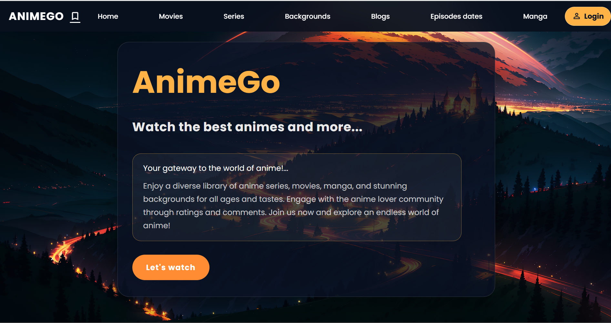
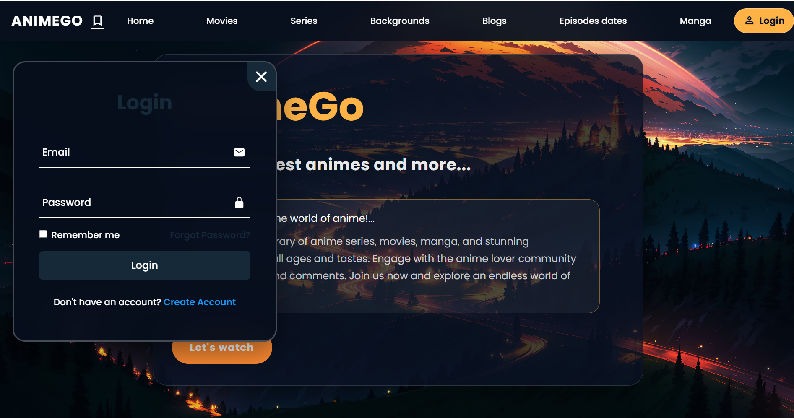
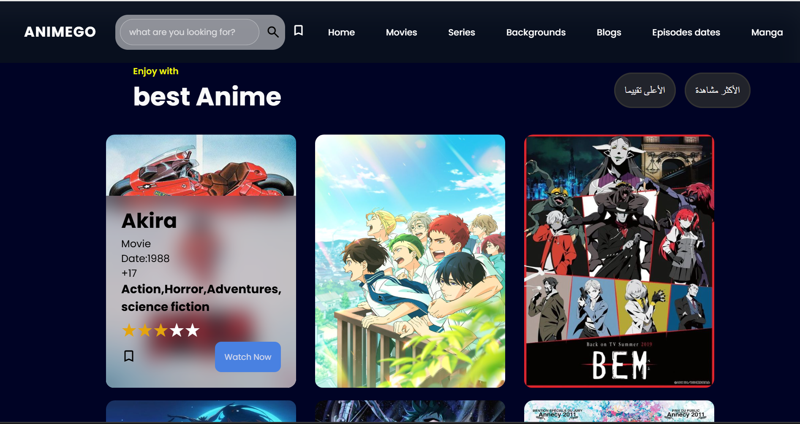
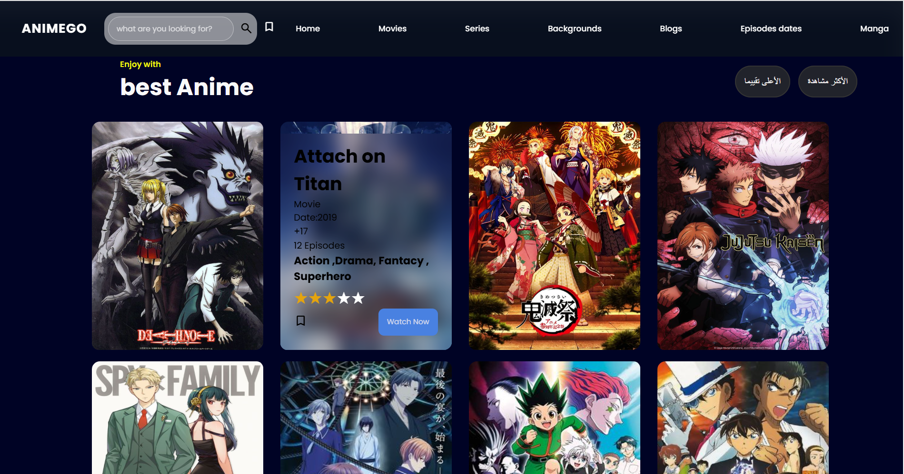
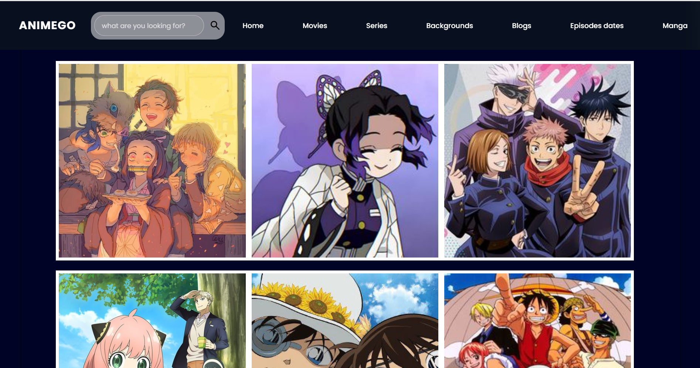
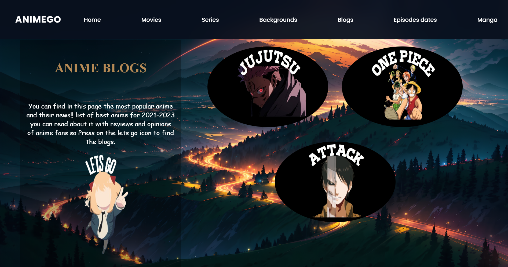
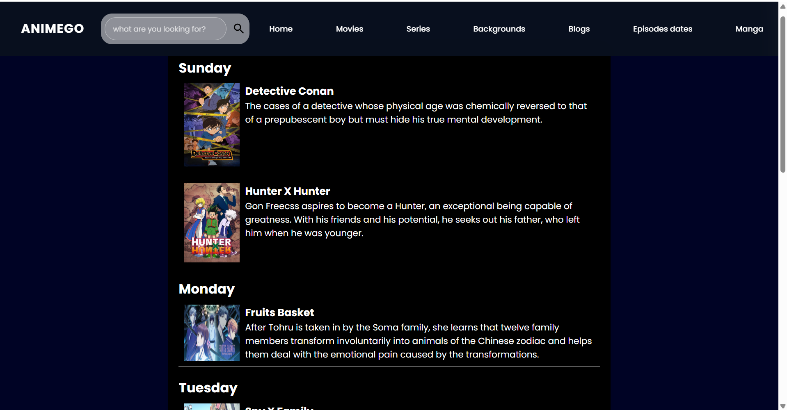

# AnimeGo

## وصف المشروع

AnimeGo هو موقع أنمي شامل ومتكامل يقدم تجربة مميزة لكل عشاق الأنمي.
الموقع يجمع بين الأفلام والمسلسلات، مواعيد الحلقات، المدونات، المانجا، والمعرض في واجهة واحدة أنيقة وحديثة.

> AnimeGo مصمم ليكون منصة أنمي متكاملة، وليس مجرد صفحة عرض بسيطة.

## Project Overview

AnimeGo is a complete anime website built with HTML, CSS, and JavaScript.
It combines movies, anime series, episode schedules, blog posts, manga content, and an image gallery into one polished experience.

> This project is designed to feel impressive and distinctive—a real anime hub rather than a basic static page.

## لماذا AnimeGo مختلف؟

- يحتوي على كل أقسام الأنمي في مكان واحد.
- تصميم متجاوب يدعم الشاشات الكبيرة والصغيرة.
- واجهة بسيطة وسلسة مع قائمة تنقل ممتدة من اليسار إلى اليمين.
- تجربة مستخدم حديثة مع نوافذ دخول واضحة.
- ألوان داكنة تناسب طابع الأنمي.

## Why AnimeGo stands out

- The website integrates movies, series, episode dates, blog content, manga, and a gallery.
- It has a modern, responsive design that works well on any device.
- The navigation looks clean and fills the top width of the page.
- The site is styled to feel like a professional anime portal.

## هيكل المشروع

- `Home.html` - الصفحة الرئيسية.
- `Movie.html` - صفحة الأفلام.
- `series.html` - صفحة المسلسلات.
- `gallery.html` - صفحة المعرض.
- `Blogs.html` - صفحة المدونات.
- `episodesDate.html` - صفحة مواعيد الحلقات.
- `savePage.html` - صفحة الحفظ/المفضلة.
- `css/` - ملفات التصميم.
- `js/script.js` - تفاعل القائمة ونوافذ الدخول.
- `images/` - الصور الخاصة بالموقع.

## لقطات الشاشة

### 1. الصفحة الرئيسية (Home)





> الصفحة الرئيسية مع التنقل الكامل وزر الدخول.

### 2. صفحة الأفلام (Movies)



> قسم عرض الأفلام.

### 3. صفحة المسلسلات (Series)



> قسم عرض المسلسلات.

### 4. صفحة المعرض (Gallery)


.png)

> معرض صور الأنمي.

### 5. صفحة المدونات (Blogs)


.png)
> صفحة المدونات والمقالات.

### 6. صفحة مواعيد الحلقات (Episodes dates)



> صفحة عرض مواعيد الحلقات.

### 7. صفحة الحفظ (Save)

> صفحة حفظ العناصر المفضلة.

## التشغيل محليًا

1. افتح المجلد في متصفح الويب.
2. افتح `Home.html`.
3. تأكد من وجود المجلدات `css/` و `js/` و `images/` في نفس المجلد.

## GitHub Repository

Repository URL:
https://github.com/ManalBafaraj/AnimeGo-Website

## إعداد Git ورفع المشروع

1. افتح الطرفية في مجلد المشروع:
   ```bash
   git init
   git add .
   git commit -m "Initial commit"
   ```
2. أضف الريموت:
   ```bash
   git remote add origin https://github.com/ManalBafaraj/AnimeGo-Website.git
   ```
3. ادفع الملفات إلى GitHub:
   ```bash
   git branch -M main
   git push -u origin main
   ```

## ملاحظة

إذا كانت لديك صلاحيات GitHub جاهزة على جهازك، يمكن تنفيذ هذه الأوامر مباشرة لتحديث المستودع.
